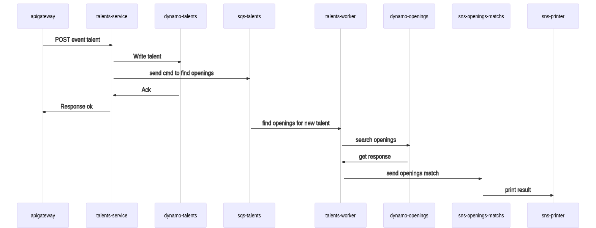

# Camada de negócios do Talent Retainer Service

## Arquitetura dos microservicos

Utilizamos da arquitetura Hexagonal para criarmos um ambiente `monorepo` controlado onde teremos controle de todo um grupo de servicos que servem um mesmo contexto.

Teremos Basicamente 5 lambdas que irão responder pelos servicos da solucão.

* openings-service - realiza as chamadas de controle de estado das vagas abertas

* talents-service  - realiza as chamadas de controle de estado dos talentos disponíveis

* openings-workers - por padrão, é responsável pelo processamento de match assíncrono, mas se configurado o sistema para operar com `WRITE_OPERATION_LEVEL='ONLY_VALIDATE'`, as operacoes de escrita do dynamo ficam de responsabilidade com ele, e as lambdas que ficam na frente do api gateway irão somente validar o dado e enviar para o SQS para processar depois. Note que o worker irá gerir dados de vagas, então para fazer o match, ele irá usar o dado da vaga nova e irá realizar uma busca no banco de dados de talents, sempre que uma vaga for criada ou alterada. O mesmo irá enviar para o topico SNS do talents-match, para que os assinantes do evento processem. O isolamento dos repositórios para os seus respectivos microservicos acabou sendo quebrado nessa parte, mas fica mapeado que o ideal é que tenhamos somente um worker, e que a base de dados dos dois repositórios sejam replicados para um `elasticsearch` para uma busca mais estruturada.

* talents-workers - é a mesma regra do worker citado acima, mas ele tem responsabilidade pelos dados de talentos, e responsável por buscar vagas sempre que um talento é criado ou alterado.

* sns-writer - um pequeno microservico usado para debugar nos logs se os eventos de match estão dando resultado, foi utilizado como ponto de prova.

## Fluxo da informacão

O fluxo de comunicacão padrão é:

Esse fluxo segue o mesmo padrão para alteracões de dados, tanto para talentos (talents) quanto para vagas (openings).

com a opcao assincrona `ONLY_VALIDATE`, o fluxo fica dessa forma:

.

Todas as comunicacoes com fila tem dead letter queue configurada, e definido para fazer `3` tentativas. O fluxo assíncrono é o fluxo mais seguro para evitar perda de dados em um volume alto de entrada.

Mas caso tenhamos problema de processamento, todos os payloads são logados no cloudwatch, onde podemos recuperar e averiguar em caso de falha. Utilizei da biblioteca `escriba` para gerar os payloads de logs, onde todas as operacoes de escrita são registradas.

## Algoritmo de match

O algoritmo foi feito de forma bem simples para validar somente a questão do uso da arquitetura.

Criamos em ambas as entidades campos de lista de `tags`:

[Você pode conferir a estrutura de dados aqui de Openings](https://claytonsilva.github.io/talent-retainer-service/global.html#Opening)

[Você pode conferir a estrutura de dados aqui de Talents](https://claytonsilva.github.io/talent-retainer-service/global.html#Talent)

* positionTags (para a empresa são as posicoes que querem preencher, e para o talento, são as posicoes que ocupou)

* hardSkillTags (hard skills que empresa busca e o talento possui)

* softSkillTags (soft skills que empresa busca e o talento possui)

Em cima dessas três listas, cruzamos a lista do proponente, basta ele bater com algum elemento de qualquer um dos campos de lista, que o match acontece.

Para realizar a busca, foi criado um [algoritmo](https://claytonsilva.github.io/talent-retainer-service/business_opening.js.html#line166) que monta a consulta no Dynamo, o worker por sua vez realiza ela.
