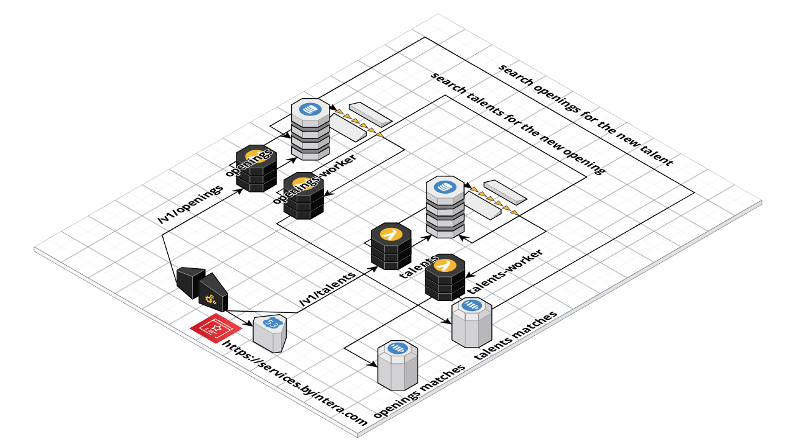

# Talent Retainer Service

[](https://coveralls.io/github/claytonsilva/talent-retainer-service?branch=master)
[](https://dashboard.stryker-mutator.io/reports/github.com/claytonsilva/talent-retainer-service/master)
[](http://standardjs.com/)
[](http://conventional-changelog.github.io)
[](https://github.com/conventional-changelog/standard-version)
[](https://circleci.com/gh/claytonsilva/talent-retainer-service)

## Objetivo do servico

O servico tem como objetivo controlar o ciclo de vida de abertura de vagas de oportunidades de trabalho e banco de talentos.

## Como é distribuído as responsabilidades

Organizo a base de código usando um esquema de monorepo me aproveitando bem da arquitetura hexagonal:

```console
.
+-- ports/aws-lambda
|   +-- talents.handler.js
|   +-- talents-worker.handler.js
|   +-- openings.handler.js
|   +-- openings-worker.handler.js

```

Por se tratar de microservicos que em conjunto resolve um problema em específico e estão interligados em termos de negócio, ficou coerente unificar todos eles em uma mesma base de código.

Utilizei o template de hexagonal [disponível nesse repositório](https://github.com/claytonsilva/nodejs-hexagonal-boilerplate) como base de desenvolvimento.

* talents.handler: responsável pelo controle de ciclo de vida dos dados de **talentos**, ele deve controlar todo o ciclo de vida, mas não terá nenhuma capacidade de escrita no repositório de dados, pois essa responsabilidade será feita pelo worker, toda operacao de escrita é assincrona.

* talents-worker.handler: responsável pelas operacoes de escrita (CREATE/UPDATE/DELETE) e também responsável por buscar matching de **talentos** quando informado no payload os dados da vaga.

* openings.handler: responsável pelo controle de ciclo de vida dos dados de **oportunidades**, ele deve controlar todo o ciclo de vida, mas não terá nenhuma capacidade de escrita no repositório de dados, pois essa responsabilidade será feita pelo worker, toda operacao de escrita é assincrona.

* openings-worker.handler: responsável pelas operacoes de escrita (CREATE/UPDATE/DELETE) e também responsável por buscar matching de **vagas** quando informado no payload os dados do talento.

Podemos perceber um comportamento nos workers que operam **em duas vias**:

* Se uma oportunidade é criada/alterada, o talents worker tenta fazer match com os talentos existentes

* Se um talento é criado/alterado, o openings worker tenta fazer match com as vagas existentes

Utilizamos SQS para realizar os trabalhos assíncronos de cada worker, DynamoDB para manter os dados de cada repositório, e um tópico de SNS para emitir sempre que ocorrer um match, do SNS pra frente, seu :heartpulse: que vai decidir o que fazer daí pra frente.

No diagrama não está diagramado o comportamento de DeadLetter, mas ela será implementada nas filas de SQS para lidar com mensagens que não processar e por sua vez, devem ser monitoradas usando CloudWatch.

### Diagrama da solucao na AWS



### Como usar esse projeto (TODO)

É bem simples de já começar rodando

1. Configure o `.env` baseado no `.env.example`;
2. ligue o localstack com `docker-compose up -d`;
3. levante o ambiente demo usando [terraform](https://www.terraform.io/) com os comandos:
```bash
$terraform init
$terraform plan (avalia se é isso mesmo que quer criar)
$terraform apply
```
4. instale as dependências com `yarn install`; e
5. rode o projeto com yarn start.

Iremos ter endpoints funcionando tanto na arquitetura da AWS simulada com localstack, quanto em endpoints no port de `http` para facilitar desenvolvimento e debug.

